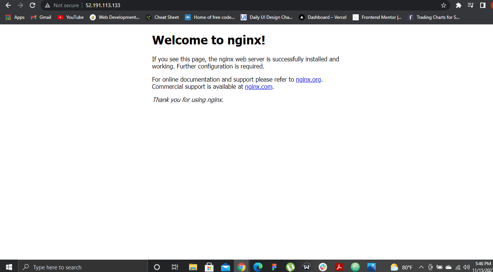
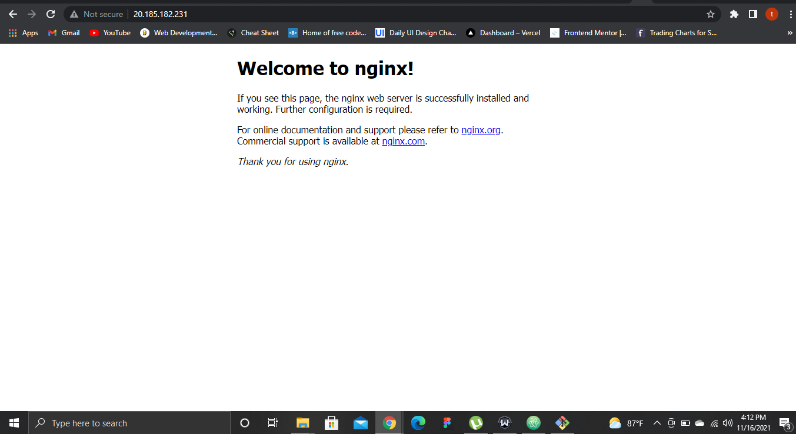

# Lab 1: Create a Linux virtual machine with the Azure CLI

1. Launch Azure Cloud Shell
2. Create a resource group
3. Create virtual machine
4. Open port 80 for web traffic
5. Connect to virtual machine
6. Install web server
7. View the web server in action

### Notes:

Quickstart: Create a Linux VM
* https://docs.microsoft.com/en-us/azure/virtual-machines/linux/quick-create-cli

Step 1: Create a Resource Group.
> Here is the output code for creating a resource group:

```
{
  "id": "/subscriptions/b5549425-9749-48f8-8db1-e22c7d47472d/resourceGroups/myResourceGroup",
  "location": "eastus",
  "managedBy": null,
  "name": "myResourceGroup",
  "properties": {
    "provisioningState": "Succeeded"
  },
  "tags": null,
  "type": "Microsoft.Resources/resourceGroups"
}
```
Step 2: Create a VM
Code input:
```
az vm create
--resource-group myResourceGroup
--name tegasVM
--image UbuntuLTS
--generate-ssh-keys
```

> Here is the output code for creating my virtual machine:

```
{
  "fqdns": "",
  "id": "/subscriptions/b5549425-9749-48f8-8db1-e22c7d47472d/resourceGroups/myResourceGroup/providers/Microsoft.Compute/virtualMachines/tegasVM",
  "location": "eastus",
  "macAddress": "00-0D-3A-52-F7-64",
  "powerState": "VM running",
  "privateIpAddress": "10.0.0.4",
  "publicIpAddress": "52.191.113.133",
  "resourceGroup": "myResourceGroup",
  "zones": ""
}
```

Step 3: Open port 80 for web traffic.

> Code input:

```
az vm open-port --port 80 --resource-group myResourceGroup --name tegasVM
```

Step 4: Connect SSH to VM.
> Code input

```
ssh tega@52.191.113.133
```
Step 5: Install web server.

> Code input

```
sudo apt-get -y update
sudo apt-get -y install nginx
```

Final Step: View the web server in action.
> Here is a screenshot of the web server in action:




Quickstart for Bash in Azure Cloud Shell
* https://docs.microsoft.com/en-us/azure/cloud-shell/quickstart

## Lab 1: Quickstart for Bash in Azure Cloud Shell
#### Create a Linux VM:

Step 1: Set subscription.
> Here is the input code for setting subscription:

```
az account set --subscription 'Azure subscription 1'
```
Step 2: Create a resource group.
> Here is the input code for a creating resource group:

```
az group create --location eastus --name MyResourcegroup
```
> Here is the output code for a creating resource group:

```
{
  "id": "/subscriptions/b5549425-9749-48f8-8db1-e22c7d47472d/resourceGroups/MyResourcegroup",
  "location": "eastus",
  "managedBy": null,
  "name": "MyResourcegroup",
  "properties": {
    "provisioningState": "Succeeded"
  },
  "tags": null,
  "type": "Microsoft.Resources/resourceGroups"
}
```


Step 3: Create a Linux VM
Code input:
```
az vm create
-n myVM
-g MyResourcegroup
--image UbuntuLTS
--generate-ssh-keys
```

> Here is the output code for creating my virtual machine:

```
{
  "fqdns": "",
  "id": "/subscriptions/b5549425-9749-48f8-8db1-e22c7d47472d/resourceGroups/myResourceGroup/providers/Microsoft.Compute/virtualMachines/myVM",
  "location": "eastus",
  "macAddress": "00-0D-3A-56-40-4D",
  "powerState": "VM running",
  "privateIpAddress": "10.0.0.4",
  "publicIpAddress": "20.185.182.231",
  "resourceGroup": "myResourceGroup",
  "zones": ""
}
```

Step 4: SSH into your Linux VM

After searching for VM name in the Azure portal search bar, Open port 80 for web traffic. Click "Connect" to get your VM name and public IP address.

1. ssh cmd to SSH into VM

```
ssh tega@20.185.182.231
```
2. ssh output:

```
The authenticity of host '20.185.182.231 (20.185.182.231)' can't be established.
ECDSA key fingerprint is SHA256:11CfB7AKCtuVcynsL0Fmnd+eIiXEcfoybmEEv5TaVxA.
Are you sure you want to continue connecting (yes/no)? yes
Warning: Permanently added '20.185.182.231' (ECDSA) to the list of known hosts.
Welcome to Ubuntu 18.04.6 LTS (GNU/Linux 5.4.0-1063-azure x86_64)

 * Documentation:  https://help.ubuntu.com
 * Management:     https://landscape.canonical.com
 * Support:        https://ubuntu.com/advantage

  System information as of Tue Nov 16 14:53:23 UTC 2021

  System load:  0.08              Processes:           108
  Usage of /:   4.6% of 28.90GB   Users logged in:     0
  Memory usage: 5%                IP address for eth0: 10.0.0.4
  Swap usage:   0%

0 updates can be applied immediately.


The programs included with the Ubuntu system are free software;
the exact distribution terms for each program are described in the
individual files in /usr/share/doc/*/copyright.

Ubuntu comes with ABSOLUTELY NO WARRANTY, to the extent permitted by
applicable law.

To run a command as administrator (user "root"), use "sudo <command>".
See "man sudo_root" for details.
```

Step 5: Install web server.

> Code input

```
sudo apt-get -y update
sudo apt-get -y install nginx
```

Final Step: View the web server in action.
> Here is a screenshot of the web server in action:



Done.
