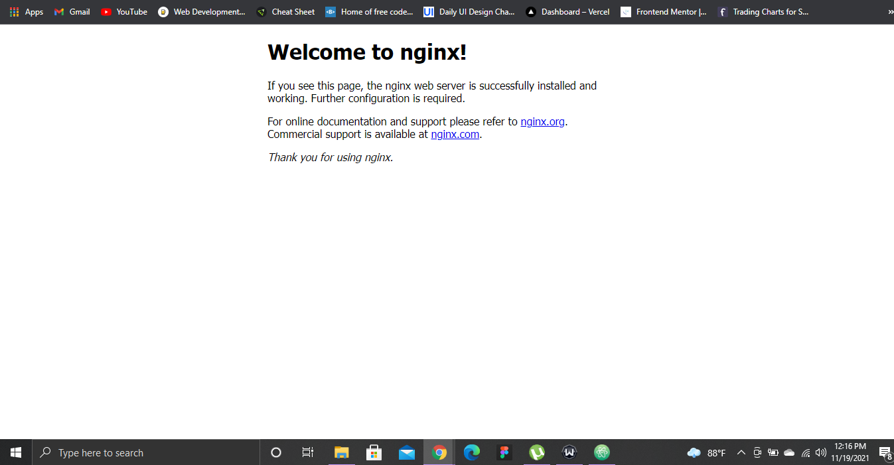

# Lab 4: Create and use an SSH public-private key pair for Linux VMs in Azure

1. Supported SSH key formats
2. Create an SSH key pair
3. Provide an SSH public key when deploying a VM
4. SSH into your VM

### Notes:

Quickstart: SSH for Linux VMs
* https://docs.microsoft.com/en-us/azure/virtual-machines/linux/mac-create-ssh-keys

Quickstart for Bash in Azure Cloud Shell
* https://docs.microsoft.com/en-us/azure/cloud-shell/quickstart

1. ### Supported SSH key formats
Azure currently supports SSH protocol 2 (SSH-2) RSA public-private key pairs with a minimum length of 2048 bits. Other key formats such as `ED25519` and `ECDSA` are not supported.

2. ### Create an SSH key pair
Use the `ssh-keygen` command to generate SSH public and private key files. By default, these files are created in the ~/.ssh directory. You can specify a different location, and an optional password (passphrase) to access the private key file. If an SSH key pair with the same name exists in the given location, those files are overwritten.

The following command creates an SSH key pair using RSA encryption and a bit length of 4096:

> Here is the input code for creating an SSH key pair using RSA encryption:

```
ssh-keygen -m PEM -t rsa -b 4096
```
> Here is the output with the randomart image:

```
Generating public/private rsa key pair.Enter file in which to save the key (/home/tega/.ssh/id_rsa):/home/tega/.ssh/id_rsa already exists.Overwrite (y/n)? y
Enter passphrase (empty for no passphrase):
Enter same passphrase again:
Your identification has been saved in /home/tega/.ssh/id_rsa.
Your public key has been saved in /home/tega/.ssh/id_rsa.pub.
The key fingerprint is:
SHA256:JSvFVUB7QruIxwiR96mJ2VoxTAlQElMyHetR1eohZ8I tega@cc-34ddea6c-7d5fd997d6-8lj5c
The key's randomart image is:
+---[RSA 4096]----+
|  B**+.o.o=o.    |
|   =o++. o.o     |
|    += .+o= .    |
|   . oE=B= +     |
|    .++@S..      |
|    o =o.        |
|     o           |
|    .            |
|                 |
+----[SHA256]-----+
```

3. ### Provide an SSH public key when deploying a VM
Code input:

To display my public key, I used the `cat` command.
```
cat ~/.ssh/id_rsa.pub
```

> Here is the output code for creating my virtual machine:

```
ssh-rsa AAAAB3NzaC1yc2EAAAADAQABAAACAQCgBLmWmEN5klS7Nk42LJkP/3thk6Opu6M13mhNg1YjKH9vrPgPwvB/AnpMv28ovBcX1VqCwnjSnJoQ3aq9JvfO9fj3JCWCsiCwTesFNo7PqZH/IO9LR3QKZdg957+vsdFu1eZZihJqApx0CLW1zdKm9Xgcah2Dw8f+fwr4/lEwmtYPEz/excVg8ZBhq4jipUlZtQ6XABqpxOuCc7lnWTUeQ8IWSiS4c/ItrwAkklYkSCasCgJjxJPlmKhbLk0rgJz6rUr0WLxd9PhkeXNu4oEVsGfvK3AcmwnlTVQZooR+9uYHz6KqRno4/UAB8tF23WW2jH4LMtwEVfunX2Ioj3N/w3RL+/H3JzQGODqId3pyUdKM8KSl6OfekrpAg0j6KhaLcWgglblLNIH9O1/D+6bU7lOw9FIaRQJn7f7Ly9FQ9QAOCz9vUf/YQdp2cm6uTxADlm6BacEukoRDvtIXBlJ1AGZW9nJtLa2AJuFUodPuUKkqf7XeYjKrNmMKtIyvidzhNp1yDjrqPcZB+zDNMY3336herYhbty0Q9teG/uYD78EzSiqGhzi2Mw1KyBIgF5E8DXDhk2qKWmrH1U59lhJ99dwSnv+bFkNo7tltMVBG8P/Mu8SNLdJLyjiKeBdpqCE8qyCfqFKcdSw3pCJ3jZwy0FFrr29iWAkOkJ5p3bKlGw== tega@cc-34ddea6c-7d5fd997d6-8lj5c
```
* To Provide the SSH public key when deploying a VM, provide the `--ssh-key-values` where the public key files is

> Code input:

```
az vm create  
--resource-group tegastutresource
--name tegasVM
--image UbuntuLTS
--admin-username tega
--ssh-key-values /home/tega/.ssh/id_rsa.pub
```

> Here is the output code:

```
{
  "fqdns": "",
  "id": "/subscriptions/b5549425-9749-48f8-8db1-e22c7d47472d/resourceGroups/tegastutresource/providers/Microsoft.Compute/virtualMachines/tegasVM",
  "location": "eastus",
  "macAddress": "00-22-48-21-5B-9A",
  "powerState": "VM running",
  "privateIpAddress": "10.0.0.4",
  "publicIpAddress": "20.120.80.158",
  "resourceGroup": "tegastutresource",
  "zones": ""
}
```

4. ### SSH into your VM

Code input:

SSH into my VM using the public IP Address.
```
ssh tega@20.120.80.158
```

> Here is the output code for creating my virtual machine:

```
The authenticity of host '20.120.80.158 (20.120.80.158)' can't be established.
ECDSA key fingerprint is SHA256:IBYnAJMlmhe/xojAT4OiH18rngF33zmJ57Wkw3Gy6eo.
Are you sure you want to continue connecting (yes/no)? yes
Warning: Permanently added '20.120.80.158' (ECDSA) to the list of known hosts.
Welcome to Ubuntu 18.04.6 LTS (GNU/Linux 5.4.0-1063-azure x86_64)

 * Documentation:  https://help.ubuntu.com
 * Management:     https://landscape.canonical.com
 * Support:        https://ubuntu.com/advantage

  System information as of Fri Nov 19 10:55:19 UTC 2021

  System load:  0.0               Processes:           108
  Usage of /:   4.7% of 28.90GB   Users logged in:     0
  Memory usage: 5%                IP address for eth0: 10.0.0.4
  Swap usage:   0%

0 updates can be applied immediately.


The programs included with the Ubuntu system are free software;
the exact distribution terms for each program are described in the
individual files in /usr/share/doc/*/copyright.

Ubuntu comes with ABSOLUTELY NO WARRANTY, to the extent permitted by
applicable law.

To run a command as administrator (user "root"), use "sudo <command>".
See "man sudo_root" for details.
```
> Here is a screenshot of the web server in action after opening port 80:


