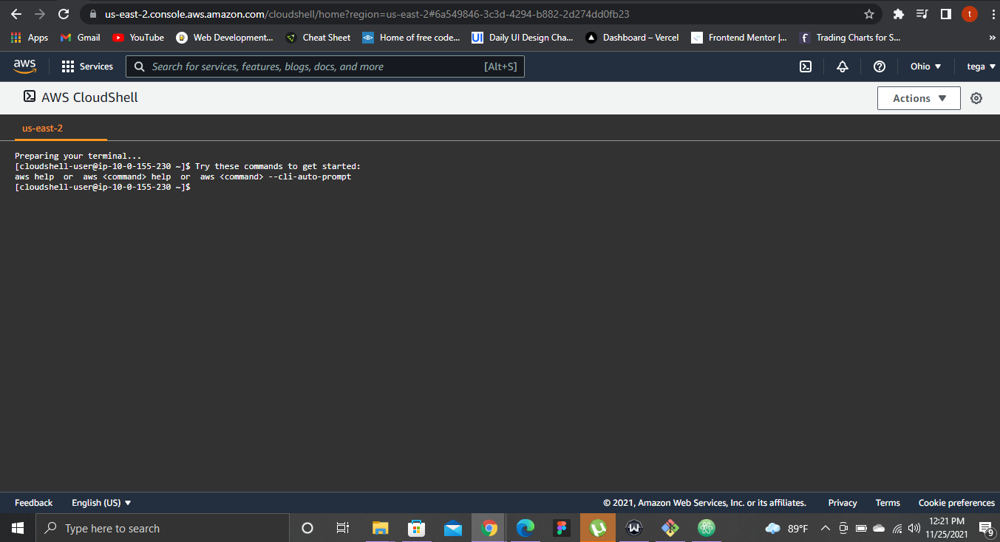
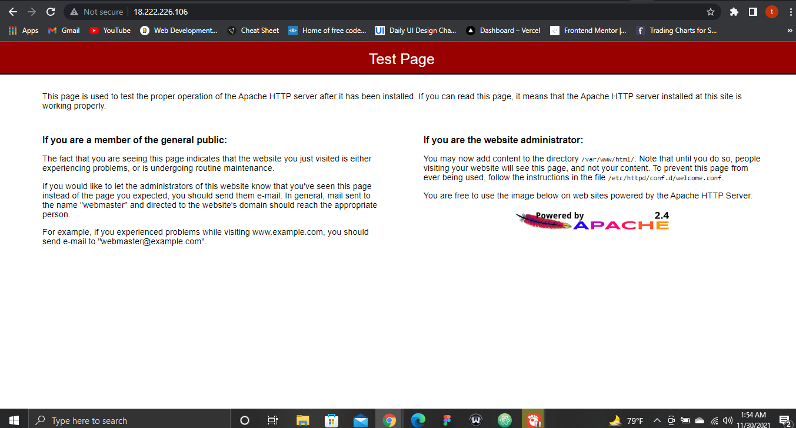

# Lab 1: Create a Linux virtual machine with the AWS CLI

1. Launch AWS Cloud Shell
2. Create virtual machine
3. Open port 80 for web traffic
4. Connect to virtual machine
5. Install web server
6. View the web server in action

### Notes:
## 1. Launch AWS Cloud Shell

> Here is a screenshot of the launched AWS Cloud shell:



## 2. Create virtual machine

* Create a VM
A Virtual Machine can be created through the aws portal usine the ec2 or by running an aws CLI command.
This instance(VM) is being created using the CLI command with and existing ssh key that was created while spinning up an instance with the ec2 instance portal.

#### Creating a default ec2 instance
> Code input:
```
aws ec2 run-instances \
    --image-id ami-0d718c3d715cec4a7 \
    --instance-type t2.micro \
    --key-name tut-awskey
```
#### Creating an ec2 instance from scratch
1. Create a VPC and subnets:

> Create a VPC:
```
aws ec2 create-vpc
--cidr-block 10.0.0.0/16
--query Vpc.VpcId
--output text
```
> output
```
vpc-0b2160e476ed1c011
```

> Create subnet 1:
```
 aws ec2 create-subnet
 --vpc-id vpc-0b2160e476ed1c011
 --cidr-block 10.0.0.0/24
```

> Create subnet 2:
```
 aws ec2 create-subnet
 --vpc-id vpc-0b2160e476ed1c011
 --cidr-block 10.0.1.0/24
```
2. Make subnets public

* Create internet gateway

>input
```
aws ec2 create-internet-gateway --query InternetGateway.InternetGatewayId --output text
```
> Output
```
igw-0e0375b2e4c1d9ca9
```

* Attach IGW to VPC:
```
aws ec2 attach-internet-gateway --vpc-id vpc-2f09a348 --internet-gateway-id igw-1ff7a07b
```

* Create a custom route table for your VPC
> input

```
aws ec2 create-route-table
--vpc-id vpc-0b2160e476ed1c011
--query RouteTable.RouteTableId
--output text
```
>output
```
rtb-0eb3c3631f30a3ba2
```
* Create a route in the route table that points all traffic `(0.0.0.0/0)` to the internet gateway:

>input
```
aws ec2 create-route
--route-table-id rtb-0eb3c3631f30a3ba2
--destination-cidr-block 0.0.0.0/0
--gateway-id igw-0e0375b2e4c1d9ca9
```
>Output
```
{
    "Return": true
}
```

* Associate route table with a subnet:
To Associate route table with a subnet, query the subnet ID by filtering the subnets associated with the custom VPC

> input
```
aws ec2 describe-subnets
--filters "Name=vpc-id,Values=vpc-0b2160e476ed1c011" --query "Subnets[*].{ID:SubnetId,CIDR:CidrBlock}"
```
> Output

```
[
    {
        "ID": "subnet-0ecc309b97365a067",
        "CIDR": "10.0.0.0/24"
    },
    {
        "ID": "subnet-00690bd5a6d03806a",
        "CIDR": "10.0.1.0/24"
    }
]
```

* Choose which subnet to associate with the custom route table

>input
```
aws ec2 associate-route-table  
--subnet-id subnet-00690bd5a6d03806a
--route-table-id rtb-0eb3c3631f30a3ba2
```

>Output
```
{
    "AssociationId": "rtbassoc-0bc300cbf63f733b7",
    "AssociationState": {
        "State": "associated"
    }
}
```
* Modify the public IP addressing behavior of the subnet so that an instance launched into the subnet automatically receives a public IP address:

>input
```
aws ec2 modify-subnet-attribute
--subnet-id subnet-00690bd5a6d03806a
--map-public-ip-on-launch
```

3. Launch an instance into your subnet
To test that your subnet is public and that instances in the subnet are accessible over the internet, launch an instance into your public subnet and connect to it. First, you must create a security group to associate with your instance, and a key pair with which you'll connect to your instance.

* Create a key pair:
>input

```
aws ec2 create-key-pair
--key-name linuxKeyPair
--query "KeyMaterial"
--output text > linuxKeyPair.pem
```

* Create a security group in your VPC

>input
```
aws ec2 create-security-group
--group-name SSHAccess
--description "Security group for SSH access"
--vpc-id vpc-0b2160e476ed1c011
```
>output
```
{
    "GroupId": "sg-0472297d113b9fdbe"
}
```
* Add a rule that allows SSH access

```
aws ec2 authorize-security-group-ingress
--group-id sg-0472297d113b9fdbe
--protocol tcp --port 22 --cidr 0.0.0.0/0
```
>output

```
{
    "Return": true,
    "SecurityGroupRules": [
        {
            "SecurityGroupRuleId": "sgr-0edc0c4149229d8ca",
            "GroupId": "sg-0472297d113b9fdbe",
            "GroupOwnerId": "949303776906",
            "IsEgress": false,
            "IpProtocol": "tcp",
            "FromPort": 22,
            "ToPort": 22,
            "CidrIpv4": "0.0.0.0/0"
        }
    ]
}
```
* Launch a Linux instance into your public subnet, using the security group and key pair you've created.

>input

```
aws ec2 run-instances
--image-id ami-0d718c3d715cec4a7
--count 1
--instance-type t2.micro
--key-name linuxKeyPair
--security-group-id sg-0472297d113b9fdbe
--subnet-id subnet-00690bd5a6d03806a
```

>Partial output

```
{
    "Groups": [],
    "Instances": [
        {
            "AmiLaunchIndex": 0,
            "ImageId": "ami-0d718c3d715cec4a7",
            "InstanceId": "i-08bd434ed9475b8ca",
            "InstanceType": "t2.micro",
            "KeyName": "linuxKeyPair",
            "LaunchTime": "2021-11-30T00:00:03+00:00",
            "Monitoring": {
                "State": "disabled"
            },
            "Placement": {
                "AvailabilityZone": "us-east-2b",
                "GroupName": "",
                "Tenancy": "default"
            },
            "PrivateDnsName": "ip-10-0-1-14.us-east-2.compute.internal",
            "PrivateIpAddress": "10.0.1.14",
            "ProductCodes": [],
            "PublicDnsName": "",
            "State": {
                "Code": 0,
                "Name": "pending"
            },
            "StateTransitionReason": "",
            "SubnetId": "subnet-00690bd5a6d03806a",
            "VpcId": "vpc-0b2160e476ed1c011",
            "Architecture": "x86_64",
            "BlockDeviceMappings": [],

```

* Query state of the instance:
>input

```
aws ec2 describe-instances
--instance-id i-08bd434ed9475b8ca
--query "Reservations[*].Instances[*].{State:State.Name,Address:PublicIpAddress}"
```
>output

```
[
    [
        {
            "State": "running",
            "Address": "18.222.226.106"
        }
    ]
]
```
* SSH into Linux instance:
>input

```
ssh -i "linuxKeyPair.pem" ec2-user@18.222.226.106
```
>Output

```
The authenticity of host '18.222.226.106 (18.222.226.106)' can't be established.
ECDSA key fingerprint is SHA256:UxCVyCQlM4LCNmjjxc+gmdqISWXu1eQZhuvEjkT37ZM.
ECDSA key fingerprint is MD5:33:f4:fc:e6:57:f7:0f:24:1f:19:5a:64:2b:78:31:73.
Are you sure you want to continue connecting (yes/no)? yes
Warning: Permanently added '18.222.226.106' (ECDSA) to the list of known hosts.

       __|  __|_  )
       _|  (     /   Amazon Linux 2 AMI
      ___|\___|___|

https://aws.amazon.com/amazon-linux-2/
```

## 3. Open port 80 for web traffic

* Add a rule that allows HTTP access from the security group or add http access from portal with publicIpAddress.

## 4. Connect to virtual machine

>input

```
ssh -i "linuxKeyPair.pem" ec2-user@18.222.226.106
```

> Output:

```

       __|  __|_  )
       _|  (     /   Amazon Linux 2 AMI
      ___|\___|___|

https://aws.amazon.com/amazon-linux-2/
```

## 5. Install web server

>input:

```
yum update -y
sudo yum install -y httpd

```
* Start server

> input

```
sudo systemctl start httpd

```

## 6. View the web server in action

> Here is a screenshot of the web server in action:



Quickstart: Create a Linux VM
* https://aws.amazon.com/getting-started/launch-a-virtual-machine-B-0/

Quickstart for AWS CloudShell
* https://docs.aws.amazon.com/cloudshell/latest/userguide/working-with-cloudshell.html
