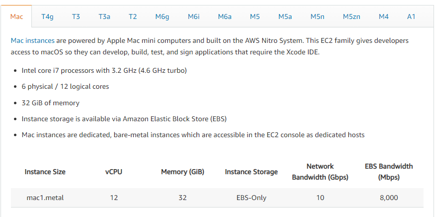

# Lab 2: Manage Linux VMs with the AWS CLI

1. Create virtual machine
2. Connect to VM
3. Understand VM images
4. Understand VM sizes
5. VM power states
6. Management tasks

### Notes:

Quickstart: Create a Linux VM

- https://aws.amazon.com/getting-started/launch-a-virtual-machine-B-0/

Using a custom Amazon machine image (AMI)

- https://docs.aws.amazon.com/elasticbeanstalk/latest/dg/using-features.customenv.html

Quickstart: Restart VM via CLI

- https://docs.aws.amazon.com/cli/latest/reference/ec2/reboot-instances.html

Quickstart for AWS CloudShell

- https://docs.aws.amazon.com/cloudshell/latest/userguide/working-with-cloudshell.html

# Things learnt from completing Lab 2.

## 1. Creating a virtual machine.

You can create a virtual machine using the AWS CLI or using the AWS console.using the console is easier. There are some things to note while creating a Virtual Machine:

1. You need to save your ssh key as a .pem file. Without it, you cannot securely access your server at a later time.

2. You can assign roles to your EC2 instances which specify how it can communicate with other AWS resources.

## 2. Connecting to the VM

To SSH to the virtual machine on AWS you need to know the location of your .pem file which contains your private key, and your public key address.

Once you have established the directory which contains your private key, you can run a bash script which allows you secure connection to your EC2 server instance.

The code used to connect to your AWS EC2 instance is as follows:

```
ssh -i "cloudskillsserver_key.pem" ec2-user@ec2-13-40-48-132.eu-west-2.compute.amazonaws.com
```


## 3. Understanding AWS AMIs (Amazon Machine Images)

Amazon Machine Images refer to snapshots of EC2 instances and their current configurations. They are used to quickly spin up EC2 instances of the same hardware and software configurations, without any customization. They can be applied in AWS autoscaling groups to create a seamsless deployment of a new EC2 instance once the load from the Elastic Load balancer gets too much.


## 4. Understanding the EC2 sizes

EC2 machines come in various sizes, and compute capacities.
The instance size majorly used within the free tier is the T2 micro instance.

For the instance performances, we have the following:

1. Compute optimized
2. Memory Optimized
3. Accelerated Computing
4. Instance Features
5. Storage Optimized
6. General Purpose.

*Image showing EC2 image sizes*


## 5. Understanding the EC2 Power States

1. **Stopped state:** Once an instance is stopped, you can still have EBS volumes attached to it, hence you can restart the instance again. You are not charged for your instance once it is stopped. Once an instance is stopped, you can attach and detach EBS volumes, you can change the ram, disk space,etc, You can also create an Amazon AMI from the instance.

2. **Terminated State:** Once an instance state is terminated, you **cannot** start the instance again. Based on the instances _deleteOnTermination_ , setting, the root volumes can be deleted. To prevent accidental termintion, you can ensure that the _disableAPITermination_ is set to true. This is to make sure that you do not accidentally delete an instance.

&#9888; Whenever you delete an instance, you cannot restart the instance again. it is lost for life

3. **Running State:** You are charged for your EC2 instances that are in their running state. DUring this state your instance and your server is running and users on the internet can access it normally.

## 6. AWS management tasks:

This can be done primarily through the AWS management console.
The AWS management console can be used to manage the various AWS services.

The AWS management console can be seen as a collection of AWS web applications; it is a web application that comprises and refers to a broad collection of service consoles for managing Amazon Web Services.

Usually when a user first signs in, he sees the console home page. The home page provides access to each service console as well as an intuitive user interface for exploring AWS and getting helpful tips.
