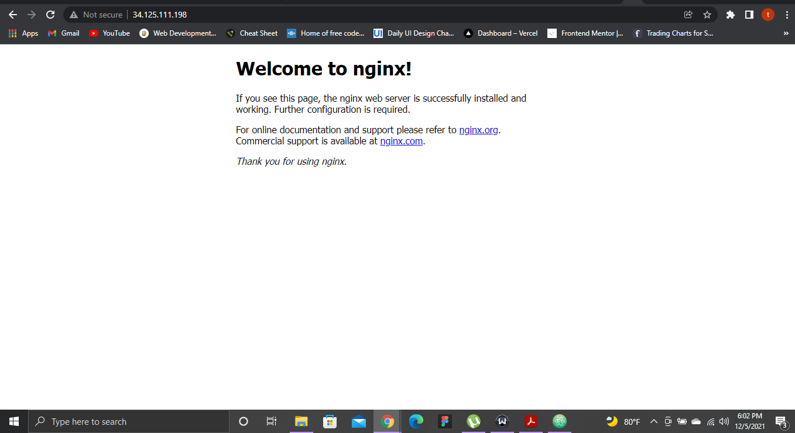
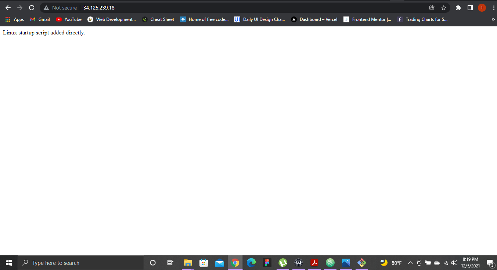
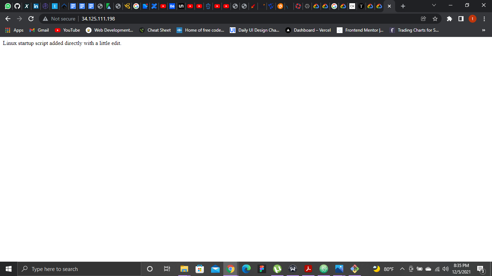

# Lab 3: GCP

## Compute Engine

[Quickstart using a Linux VM](https://cloud.google.com/compute/docs/quickstart-linux "Quickstart using a Linux VM")

1. In the Cloud Console, go to the Create an instance page. `Go to Create an instance`

2. In the **Boot disk** section, click **Change** to begin configuring your boot disk.
3. On the **Public images** tab, choose **Ubuntu** from the **Operating system** list.
4. Choose **Ubuntu 20.04 LTS** from the **Version** list.
5. Click **Select**.
6. In the **Firewall** section, select **Allow HTTP traffic**.
To create the VM, click **Create**.

[Connect to Linux VMs](https://cloud.google.com/compute/docs/instances/connecting-to-instance "Connect to Linux VMs")

1. In the list of virtual machine instances, click SSH in the row of the instance that you want to connect to.

2. Open ssh in browser automatically connects into the VM.

3. I copied the command to input in the CLI as an alternative to ssh into the VM.
```bash
gcloud beta compute ssh --zone "us-west4-b" "tega-1"  --tunnel-through-iap --project "forward-venture-333717"
```
4. To test run the VM, I installed nginx server.



[Connecting to Linux VMs using advanced methods](https://cloud.google.com/compute/docs/instances/connecting-advanced "Connecting to Linux VMs using advanced methods")

1. Using the bash CLI
```Bash
gcloud beta compute ssh --zone "us-west4-b" "tega-2"  --tunnel-through-iap --project "forward-venture-333717"
```
I was able to ssh into the new VM.

[Using startup scripts on Linux VMs](https://cloud.google.com/compute/docs/instances/startup-scripts/linux "Using startup scripts on Linux VMs")

### Passing a Linux startup script directly to a new VM

1. In the Google Cloud Console, go to the **Create an instance** page.

2. For **Boot disk**, select **Change**, and select a **Linux** operating system.

3. Expand the **Networking, disks, security, management, sole tenancy** section, and do the following:

* Expand the **Management** section.
* In the **Automation** section, add the following startup script:
```
#! /bin/bash
apt update
apt -y install apache2
cat <<EOF > /var/www/html/index.html
<html><body><p>Linux startup script added directly.</p></body></html>
```
4. Click **Create**


### Passing a Linux startup script directly to an existing VM

1. Click **Edit**.

2. Under **Custom metadata**, specify the following:
* key: `startup-script`
* value:
```
#! /bin/bash
apt update
apt -y install apache2
cat <<EOF > /var/www/html/index.html
<html><body><p>Linux startup script added directly with a little edit.</p></body></html>
```
3. Verify startup script.



### Passing a Linux startup script from a local file


[Querying VM metadata](https://cloud.google.com/compute/docs/metadata/querying-metadata "Querying VM metadata")

I was also able to install a web server apache2, verify that it's working and able to survive a reboot
```bash
sudo install apache2
```
```bash
sudo systemctl start apache2
```
```Bash
sudo systemctl enable apache2
```
Access using this ip address `34.125.239.18`
