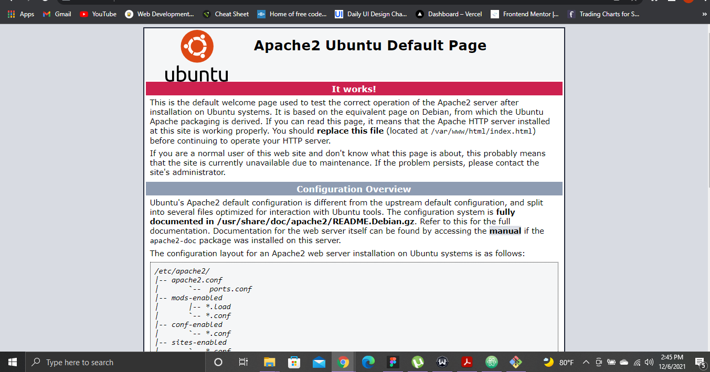

# Lab 4: Manage Packages and Services on a Linux VM (Azure or AWS)

1. Create a Linux VM
2. Install the Apache Web Server
3. Start the service status via command line
4. Investigate the service status via command line
5. Stop the service

Challenge: Create a boostrapping script that will install and start this service on new EC2 VMs

### Notes:

Install and Configure Apache (Ubuntu)
* https://ubuntu.com/tutorials/install-and-configure-apache#1-overview

#### 1. Create a Linux VM (AWS)

VPC ID:
```bash
vpc-0efa76f4294411062
```
InternetGatewayId
```Bash
igw-0d439230b098c1365
```
RouteTableId
```Bash
rtb-0d3f45e7f956f54a8
```
SubnetId
```Bash
subnet-08b95d3d0853fa43a
```
security GroupId
```Bash
GroupId: sg-09c7dee00dfd81398
```
Ubuntu ImageId
```bash
ami-0629230e074c580f2S
```

InstanceId
```bash
i-0171f76897f415a7b
```
#### 2. Install the Apache Web Server

```bash
sudo apt update
sudo apt install apache2
```
#### 3. Start the service status via command line
```Bash
sudo systemctl start httpd
```
> Apache2 server in action:



#### 4. Investigate the service status via command line
After we've successfully installed and started our web server, we need to check it's status to confirm whether or not it is running. We can do this by actually viewing the server using our IP address.

#### 5.  Stop the service
The following command is to disable or stop the apache service from running:

>To stop the web server

```Bash
sudo systemctl stop httpd
```
> To disable the webserver

```Bash
sudo systemctl disable httpd
```

How to install Apache on RHEL 8 / CentOS 8 Linux
* https://linuxconfig.org/installing-apache-on-linux-redhat-8

How to use cloud-init to customize a Linux virtual machine in Azure on first boot
* https://docs.microsoft.com/en-us/azure/virtual-machines/linux/tutorial-automate-vm-deployment

Create bootstrap actions to install additional software
* https://docs.aws.amazon.com/emr/latest/ManagementGuide/emr-plan-bootstrap.html
