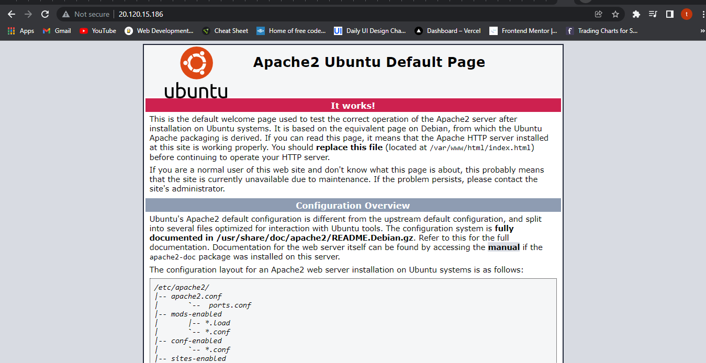
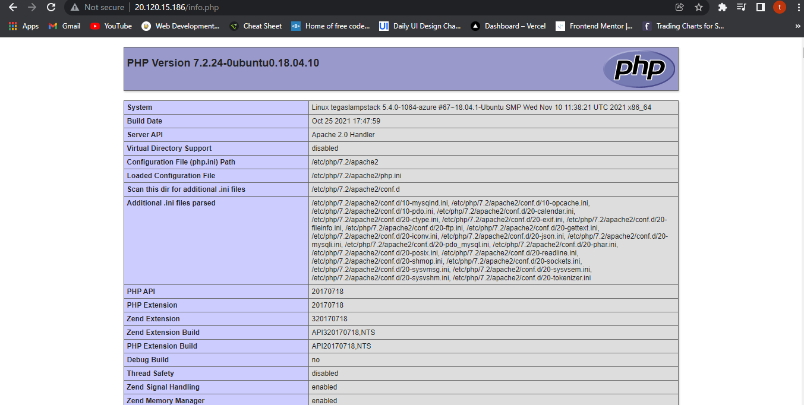
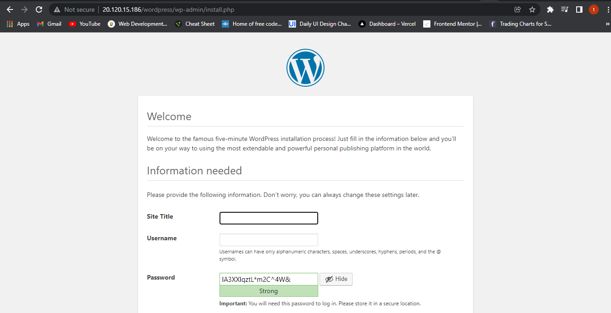
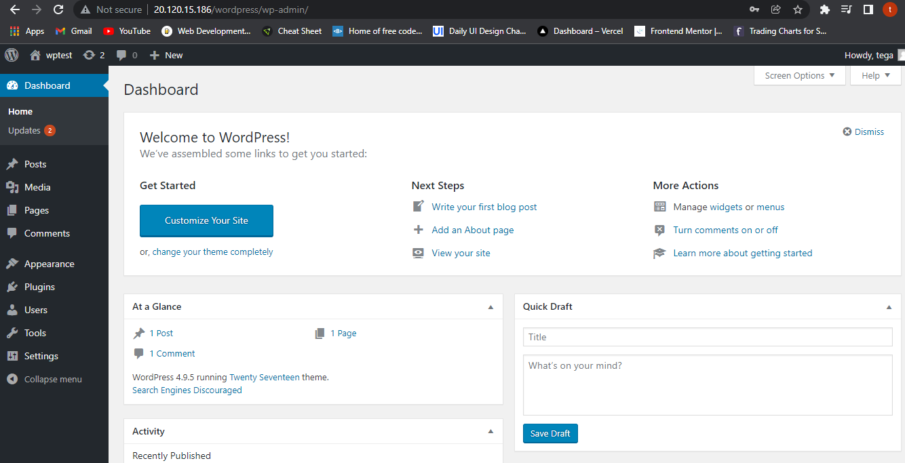

# Lab 1: Install a LAMP stack on an Azure Linux VM

1. Create a resource group
2. Create a virtual machine
3. Open port 80 for web traffic
4. SSH into your VM
5. Install Apache, MySQL, and PHP
6. Install WordPress

### Notes:

Tutorial: Install a LAMP stack on an Azure Linux VM
* https://docs.microsoft.com/en-us/azure/virtual-machines/linux/tutorial-lamp-stack
#### 1. Create a resource group
>input

```bash
az group create --name LAMPSTACKRG --location eastus

```
> output

```bash
{
  "id": "/subscriptions/b5549425-9749-48f8-8db1-e22c7d47472d/resourceGroups/LAMPSTACKRG",
  "location": "eastus",
  "managedBy": null,
  "name": "LAMPSTACKRG",
  "properties": {
    "provisioningState": "Succeeded"
  },
  "tags": null,
  "type": "Microsoft.Resources/resourceGroups"
}

```
#### 2. Create a virtual machine
> input

```bash
az vm create --resource-group LAMPSTACKRG --name tegaslampstack --image ubuntuLTS  --admin-username tega --generate-ssh-keys

```

> output

```bash
{
  "fqdns": "",
  "id": "/subscriptions/b5549425-9749-48f8-8db1-e22c7d47472d/resourceGroups/LAMPSTACKRG/providers/Microsoft.Compute/virtualMachines/tegaslampstack",
  "location": "eastus",
  "macAddress": "00-0D-3A-1D-F0-C1",
  "powerState": "VM running",
  "privateIpAddress": "10.0.0.5",
  "publicIpAddress": "20.120.15.186",
  "resourceGroup": "LAMPSTACKRG",
  "zones": ""
}
```
#### 3. Open port 80 for web traffic.
> input

```bash
az vm open-port --port 80 --resource-group LAMPSTACKRG --name tegaslampstack

```
#### 4. SSH into your VM

> input

```bash
ssh tega@20.120.15.186

```

#### 5. Install Apache, MySQL, and PHP

> input

```bash
sudo apt update && sudo apt install lamp-server^
```
> Verify Apache

```bash
apache2 -v
```
> output

```bash
Server version: Apache/2.4.29 (Ubuntu)
Server built:   2021-11-14T23:52:18
```

> Apache2 webserver in action:


> Verify MySQL

```bash
mysql -v
```
> output

```bash
mysql  Ver 14.14 Distrib 5.7.36, for Linux (x86_64) using  EditLine wrapper
```
* Secure installation of MySQL:
> input

```bash
sudo mysql_secure_installation
```

> Verify PHP

```bash
php -v
```
> output

```bash
PHP 7.2.24-0ubuntu0.18.04.10 (cli) (built: Oct 25 2021 17:47:59) ( NTS )
Copyright (c) 1997-2018 The PHP Group
Zend Engine v3.2.0, Copyright (c) 1998-2018 Zend Technologies
    with Zend OPcache v7.2.24-0ubuntu0.18.04.10, Copyright (c) 1999-2018, by Zend Technologies
```
* PHP Test page
> input

```bash
sudo sh -c 'echo "<?php phpinfo(); ?>" > /var/www/html/info.php'
```
> PHP Test page in action:



#### 6. Install WordPress
> input

```bash
sudo apt install wordpress
```
#### Configure WordPress
> input

```bash
sudo sensible-editor wordpress.sql
```
> input script

```bash
CREATE DATABASE wordpress;
GRANT SELECT,INSERT,UPDATE,DELETE,CREATE,DROP,ALTER
ON wordpress.*
TO wordpress@localhost
IDENTIFIED BY 'Lampstack1@';
```
* Configure PHP:
> input

```bash
sudo sensible-editor /etc/wordpress/config-localhost.php
```
> input script:

```bash
<?php
define('DB_NAME', 'wordpress');
define('DB_USER', 'wordpress');
define('DB_PASSWORD', 'Lampstak1@');
define('DB_HOST', 'localhost');
define('WP_CONTENT_DIR', '/usr/share/wordpress/wp-content');
?>
```
* Move wordpress installation to the web server document root:

```bash
sudo ln -s /usr/share/wordpress /var/www/html/wordpress

sudo mv /etc/wordpress/config-localhost.php /etc/wordpress/config-default.php
```
> WordPress webserver in action:


> WordPress webserver in action:


Sample Gist
* https://gist.github.com/mikepfeiffer/96d659042f0575a617648a33c92b8f4a

Build and run a web application with the MEAN stack on an Azure Linux virtual machine
* https://docs.microsoft.com/en-us/learn/modules/build-a-web-app-with-mean-on-a-linux-vm/

MEAN Stack App
* https://github.com/MicrosoftDocs/mslearn-build-a-web-app-with-mean-on-a-linux-vm
