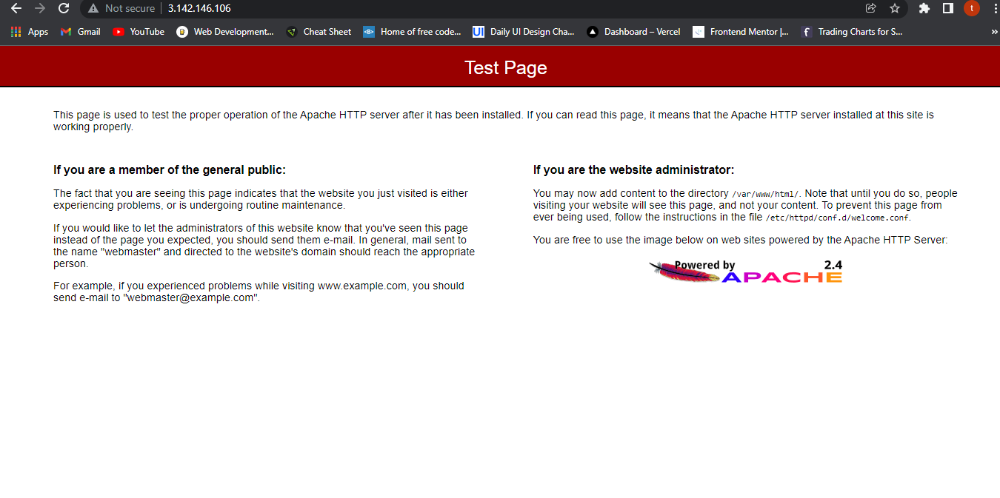
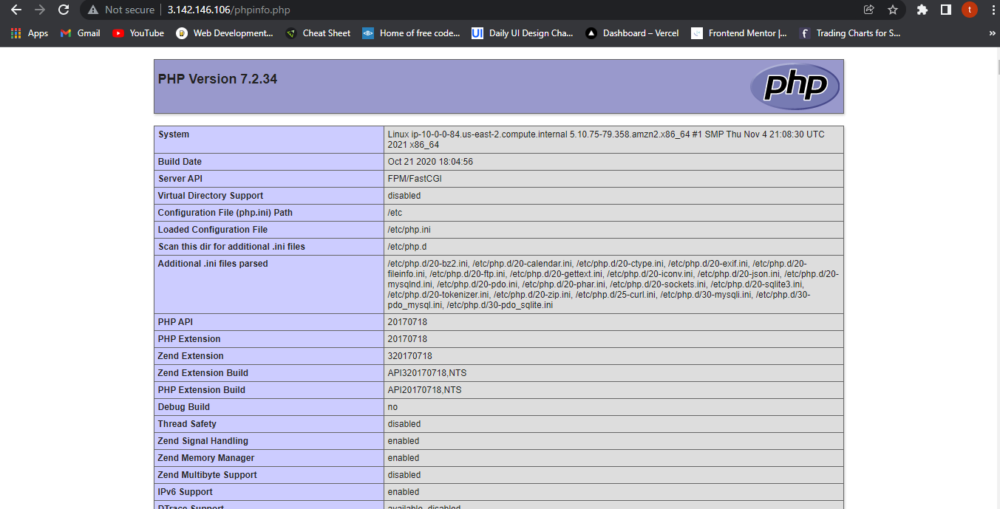
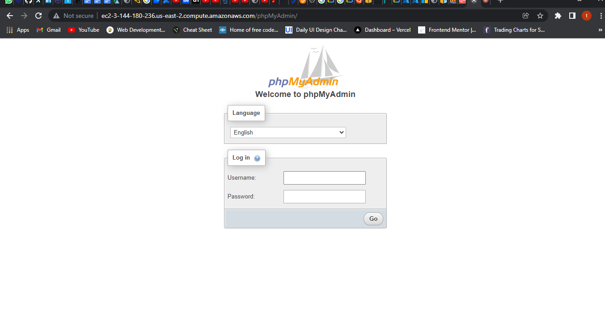
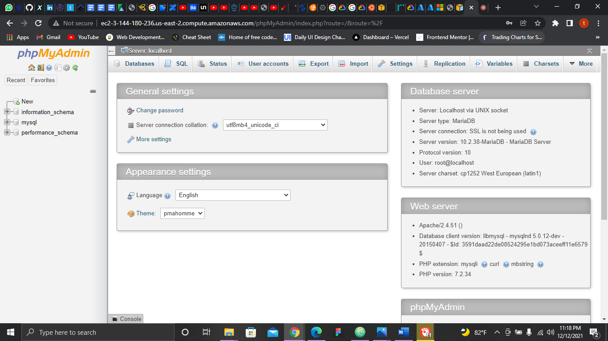

# Lab 2: Install a LAMP stack on an Amazon Linux VM

1. Prepare the LAMP server
2. Test your Lamp server
3. Secure the database server
4. (Optional) Install phpMyAdmin.

### Notes:

#### 1. Prepare the LAMP server
1. Launch Instance with Amazon Linux AMI
* Configure the security group to allow SSH (port 22), HTTP (port 80), and HTTPS (port 443) connections.
* SSH into the instance
* Make sure software packages are up to date using the `sudo yum update -y`

2. install lamp-mariadb10.2-php7.2 and php7.2.

```bash
sudo amazon-linux-extras install -y lamp-mariadb10.2-php7.2 php7.2
```
* install multiple software packages and all related dependencies

```bash
sudo yum install -y httpd mariadb-server
```
* To check AMI version:
```bash
cat /etc/system-release
```
* Start Apache webserver
```bash
sudo systemctl start httpd
```

* The `sudo systemctl enable httpd` command is used to configure the Apache web server to start at each system boot.
- output
```bash
Created symlink from /etc/systemd/system/multi-user.target.wants/httpd.service to /usr/lib/systemd/system/httpd.service.
```
> LAMP webserver in action:


3. Set file permisions
* Add your user (in this case, `ec2-user`) to the apache group.
```bash
sudo usermod -a -G apache ec2-user
```
* Log out and then log back in again to pick up the new group, and then verify your membership.
```bash
groups
```
* Change the group ownership of `/var/www`and its contents to the apache group.

```bash
sudo chown -R ec2-user:apache /var/www
```
* To add group write permissions and to set the group ID on future subdirectories, change the directory permissions of `/var/www` and its subdirectories.
```bash
sudo chmod 2775 /var/www && find /var/www -type d -exec sudo chmod 2775 {} \;
```
* To add group write permissions, recursively change the file permissions of `/var/www` and its subdirectories:
```bash
 find /var/www -type f -exec sudo chmod 0664 {} \;
```
#### 2. Test your Lamp server  
* Create a PHP file in the Apache document root.
```bash
echo "<?php phpinfo(); ?>" > /var/www/html/phpinfo.php
```
> phpinfo in action:



#### 3. Securing the database server.

* Secure the MySQL server.


* To start the MySQL (mariabd) server:
```bash
sudo systemctl start mariadb
```
```bash
sudo mysql_secure_installation
```

* When prompted enter new password.
* To stop MySQL (mariabd) server if not being used right away
```bash
sudo systemctl stop mariadb
```
* To enable server to start at every boot:
```bash
sudo systemctl enable mariadb
```
#### 4. (Optional) Install phpMyAdmin
* Install required dependencies:
```bash
sudo yum install php-mbstring php-xml -y
```
* Restart Apache.
```bash
sudo systemctl restart httpd
```
* Restart php-fpm.
```bash
sudo systemctl restart php-fpm
```
* Navigate to the Apache document root at `/var/www/html.`
```bash
cd /var/www/html
```
* Select a source package for the latest phpMyAdmin
```bash
wget https://www.phpmyadmin.net/downloads/phpMyAdmin-latest-all-languages.tar.gz
```
* Create a phpMyAdmin folder and extract the package into it with the following command.
```bash
mkdir phpMyAdmin && tar -xvzf phpMyAdmin-latest-all-languages.tar.gz -C phpMyAdmin --strip-components 1
```
* Delete the phpMyAdmin-latest-all-languages.tar.gz tarball.
```bash
rm phpMyAdmin-latest-all-languages.tar.gz
```
*  If the MySQL server is not running, start it now.
```Bash
sudo systemctl start mariadb
```
* In a web browser, type the URL of your phpMyAdmin installation.




Tutorial: Install a LAMP web server on the Amazon Linux AMI
* https://docs.
aws.amazon.com/AWSEC2/latest/UserGuide/install-LAMP.html

Tutorial: Host a WordPress blog on Amazon Linux 2
* https://docs.aws.amazon.com/AWSEC2/latest/UserGuide/hosting-wordpress.html

Sample Gist
* https://gist.github.com/mikepfeiffer/c079608703e604224e58a3d40d0fa043#file-lamp-linux-aws-sh
