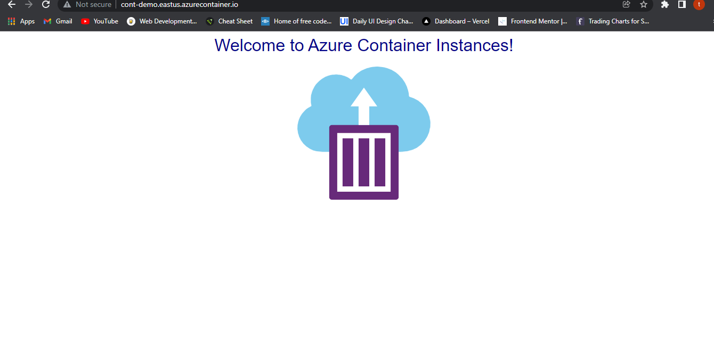

# Lab 1: Deploy a container instance in Azure using the Azure CLI

1. Create a resource group
2. Create a container
3. Pull the container logs
4. Attach output streams
5. Clean up resources

### Notes:

Quickstart: Deploy a container instance in Azure using the Azure CLI
### 1. Create a resource group

>input
```bash
az group create --name myResourceGroup --location eastus
```
### 2. Create a container
>input
```bash
az container create --resource-group myResourceGroup --name mycontainer --image mcr.microsoft.com/azuredocs/aci-helloworld --dns-name-label cont-demo --ports 80
```

* To check the status of the container:
```bash
az container show --resource-group myResourceGroup --name mycontainer --query "{FQDN:ipAddress.fqdn,ProvisioningState:provisioningState}" --out table
```

>output

```Bash
FQDN                                ProvisioningState
----------------------------------  -------------------
cont-demo.eastus.azurecontainer.io  Succeeded
```

* Here is a screenshot of the deployed Docker container to Azure:



### 3. Pull the container logs

* When you need to troubleshoot a container or the application it runs (or just to see its output), start by viewing the container instance's logs.

>input

```bash
az container logs --resource-group myResourceGroup --name mycontainer

```
>output

```bash
listening on port 80
::ffff:10.92.0.5 - - [13/Dec/2021:17:54:35 +0000] "GET / HTTP/1.1" 200 1663 "-" "Mozilla/5.0 (Windows NT 10.0; Win64; x64) AppleWebKit/537.36 (KHTML, like Gecko) Chrome/96.0.4664.93 Safari/537.36"
::ffff:10.92.0.5 - - [13/Dec/2021:17:54:36 +0000] "GET /favicon.ico HTTP/1.1" 404 150 "http://cont-demo.eastus.azurecontainer.io/" "Mozilla/5.0 (Windows NT 10.0; Win64; x64) AppleWebKit/537.36 (KHTML, like Gecko) Chrome/96.0.4664.93 Safari/537.36"
::ffff:10.92.0.6 - - [13/Dec/2021:18:00:34 +0000] "GET / HTTP/1.1" 200 1663 "-" "Mozilla/5.0 (Windows NT 10.0; Win64; x64) AppleWebKit/537.36 (KHTML, like Gecko) Chrome/79.0.3945.117 Safari/537.36"
```
### 4. Attach output streams
In addition to viewing the logs, you can attach your local standard out and standard error streams to that of the container.
* First, execute the `az container attach` command to attach your local console to the container's output streams:
>input
```bash
az container attach --resource-group myResourceGroup --name mycontainer
```
>output after detaching console with `Ctrl+c`

```Bash
Container 'mycontainer' is in state 'Running'...
(count: 1) (last timestamp: 2021-12-13 17:45:58+00:00) Successfully pulled image "mcr.microsoft.com/azuredocs/aci-helloworld@sha256:565dba8ce20ca1a311c2d9485089d7ddc935dd50140510050345a1b0ea4ffa6e"
(count: 1) (last timestamp: 2021-12-13 17:45:58+00:00) pulling image "mcr.microsoft.com/azuredocs/aci-helloworld@sha256:565dba8ce20ca1a311c2d9485089d7ddc935dd50140510050345a1b0ea4ffa6e"
(count: 1) (last timestamp: 2021-12-13 17:46:06+00:00) Started container
Start streaming logs:listening on port 80
::ffff:10.92.0.5 - - [13/Dec/2021:17:54:35 +0000] "GET / HTTP/1.1" 200 1663 "-" "Mozilla/5.0 (Windows NT 10.0; Win64; x64) AppleWebKit/537.36 (KHTML, like Gecko) Chrome/96.0.4664.93 Safari/537.36"
::ffff:10.92.0.5 - - [13/Dec/2021:17:54:36 +0000] "GET /favicon.ico HTTP/1.1" 404 150 "http://cont-demo.eastus.azurecontainer.io/" "Mozilla/5.0 (Windows NT 10.0; Win64;
listening on port 80
::ffff:10.92.0.5 - - [13/Dec/2021:17:54:35 +0000] "GET / HTTP/1.1" 200 1663 "-" "Mozilla/5.0 (Windows NT 10.0; Win64; x64) AppleWebKit/537.36 (KHTML, like Gecko) Chrome
/96.0.4664.93 Safari/537.36"
::ffff:10.92.0.5 - - [13/Dec/2021:17:54:36 +0000] "GET /favicon.ico HTTP/1.1" 404 150 "http://cont-demo.eastus.azurecontainer.io/" "Mozilla/5.0 (Windows NT 10.0; Win64;
listening on port 80
::ffff:10.92.0.5 - - [13/Dec/2021:17:54:35 +0000] "GET / HTTP/1.1" 200 1663 "-" "Mozilla/5.0 (Windows NT 10.0; Win64; x64) AppleWebKit/537.36 (KHTML, like Gecko) Chrome
/96.0.4664.93 Safari/537.36"
::ffff:10.92.0.5 - - [13/Dec/2021:17:54:36 +0000] "GET /favicon.ico HTTP/1.1" 404 150 "http://cont-demo.eastus.azurecontainer.io/" "Mozilla/5.0 (Windows NT 10.0; Win64;
 x64) AppleWebKit/537.36 (KHTML, like Gecko) Chrome/96.0.4664.93 Safari/537.36"
::ffff:10.92.0.6 - - [13/Dec/2021:18:00:34 +0000] "GET / HTTP/1.1" 200 1663 "-" "Mozilla/5.0 (Windows NT 10.0; Win64; x64) AppleWebKit/537.36 (KHTML, like Gecko) Chrome
/79.0.3945.117 Safari/537.36"
::ffff:10.92.0.6 - - [13/Dec/2021:18:09:02 +0000] "GET / HTTP/1.1" 304 - "-" "Mozilla/5.0 (Windows NT 10.0; Win64; x64) AppleWebKit/537.36 (KHTML, like Gecko) Chrome/96.0.4664.93 Safari/537.36"
::ffff:10.92.0.5 - - [13/Dec/2021:18:09:36 +0000] "GET / HTTP/1.1" 304 - "-" "Mozilla/5.0 (Windows NT 10.0; Win64; x64) AppleWebKit/537.36 (KHTML, like Gecko) Chrome/96.0.4664.93 Safari/537.36"
::ffff:10.92.0.5 - - [13/Dec/2021:18:09:38 +0000] "GET / HTTP/1.1" 304 - "-" "Mozilla/5.0 (Windows NT 10.0; Win64; x64) AppleWebKit/537.36 (KHTML, like Gecko) Chrome/96.0.4664.93 Safari/537.36"
::ffff:10.92.0.5 - - [13/Dec/2021:18:09:40 +0000] "GET / HTTP/1.1" 304 - "-" "Mozilla/5.0 (Windows NT 10.0; Win64; x64) AppleWebKit/537.36 (KHTML, like Gecko) Chrome/96.0.4664.93 Safari/537.36"
```

### 5. Clean up resources
* Remove the Container
```bash
az container delete --resource-group myResourceGroup --name mycontainer
```
* Verify Container has been removed
```bash
az container list --resource-group myResourceGroup --output table
```
* Delete Resource group
```bash
az group delete --name myResourceGroup -y
```


* https://docs.microsoft.com/en-us/azure/container-instances/container-instances-quickstart
