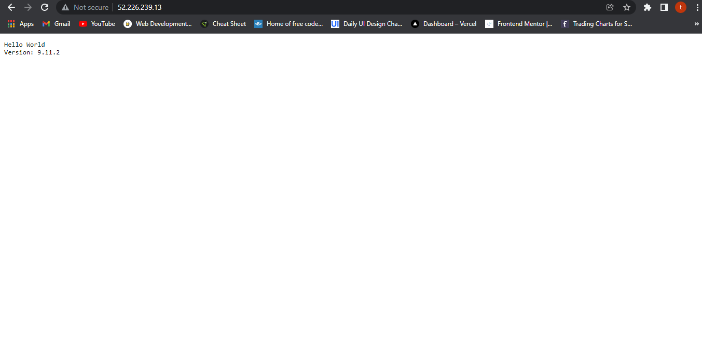
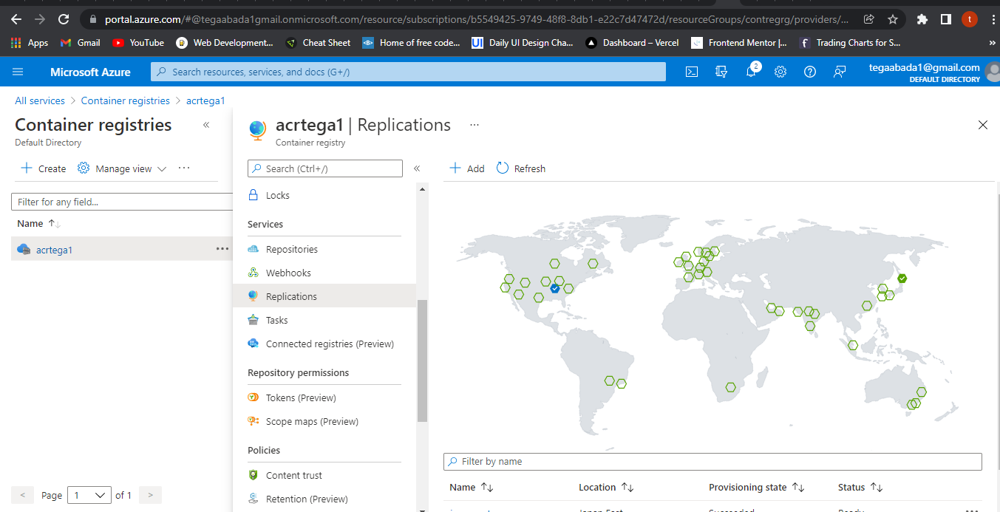

# Lab 2: Build and store container images with Azure Container Registry

1. Deploy Azure Container Registry
2. Build container images with Azure Container Registry Tasks
3. Deploy images from Azure Container Registry
4. Replicate a container image to different Azure regions

### Notes:

Build and store container images with Azure Container Registry

### 1. Deploy Azure Container Registry
* Create ne resource group
```Bash
az group create --name contregrg --location eastus
```
* Run the following command to define a variable called ACR_NAME
```bash
ACR_NAME=acrtega1
```
* Run the following command in Cloud Shell to create a new container registry.
```bash
az acr create --resource-group contregrg --name $ACR_NAME --sku Premium
```
>output
```bash
{
  "adminUserEnabled": false,
  "anonymousPullEnabled": false,
  "creationDate": "2021-12-13T21:00:58.914270+00:00",
  "dataEndpointEnabled": false,
  "dataEndpointHostNames": [],
  "encryption": {
    "keyVaultProperties": null,
    "status": "disabled"
  },
  "id": "/subscriptions/b5549425-9749-48f8-8db1-e22c7d47472d/resourceGroups/contregrg/providers/Microsoft.ContainerRegistry/registries/acrtega1",
  "identity": null,
  "location": "eastus",
  "loginServer": "acrtega1.azurecr.io",
  "name": "acrtega1",
  "networkRuleBypassOptions": "AzureServices",
  "networkRuleSet": {
    "defaultAction": "Allow",
    "ipRules": [],
    "virtualNetworkRules": []
  },
  "policies": {
    "exportPolicy": {
      "status": "enabled"
    },
    "quarantinePolicy": {
      "status": "disabled"
    },
    "retentionPolicy": {
      "days": 7,
      "lastUpdatedTime": "2021-12-13T21:01:01.400528+00:00",
      "status": "disabled"
    },
    "trustPolicy": {
      "status": "disabled",
      "type": "Notary"
    }
  },
  "privateEndpointConnections": [],
  "provisioningState": "Succeeded",
  "publicNetworkAccess": "Enabled",
  "resourceGroup": "contregrg",
  "sku": {
    "name": "Premium",
    "tier": "Premium"
  },
  "status": null,
  "systemData": {
    "createdAt": "2021-12-13T21:00:58.914270+00:00",
    "createdBy": "tegaabada1@gmail.com",
    "createdByType": "User",
    "lastModifiedAt": "2021-12-13T21:00:58.914270+00:00",
    "lastModifiedBy": "tegaabada1@gmail.com",
    "lastModifiedByType": "User"
  },
  "tags": {},
  "type": "Microsoft.ContainerRegistry/registries",
  "zoneRedundancy": "Disabled"
}
```
### 3. Build container images with Azure Container Registry Tasks
1. Create a container image with Azure Container Registry Tasks
* Run the following command in Cloud Shell to open the editor.
`code`
* Copy the following contents into the editor.
```bash
FROM    node:9-alpine
ADD     https://raw.githubusercontent.com/Azure-Samples/acr-build-helloworld-node/master/package.json /
ADD     https://raw.githubusercontent.com/Azure-Samples/acr-build-helloworld-node/master/server.js /
RUN     npm install
EXPOSE  80
CMD     ["node", "server.js"]
```
* Press `Ctrl+S`to save your changes. Name the file `Dockerfile` when prompted.

*This configuration adds a `Node.js` application to the `node:9-alpine` image. After that, it configures the container to serve the application on port 80 via the `EXPOSE` instruction.*

* Run the following Azure CLI command to build the container image from the Dockerfile.
```bash
az acr build --registry $ACR_NAME --image helloacrtasks:v1 .
```
* Verify the image
```bash
az acr repository list --name $ACR_NAME --output table
```
### 3. Deploy images from Azure Container Registry

* Enable the registry admin account
```bash
az acr update -n $ACR_NAME --admin-enabled true
```
* Run the following command in Cloud Shell to retrieve the username and password for the admin account
>input
```bash
az acr credential show --name $ACR_NAME
```
>output
```bash
{
  "passwords": [
    {
      "name": "password",
      "value": "thermT9TO+RcH3v32oE1k1vBdnhfq6Wn"
    },
    {
      "name": "password2",
      "value": "6d/dlS893kxIwE0ROMSWO1Ijsw2DmaXD"
    }
  ],
  "username": "acrtega1"
}
```

* Deploy a container with Azure CLI

```bash
az container create --resource-group contregrg --name acr-tasks --image $ACR_NAME.azurecr.io/helloacrtasks:v1 --registry-login-server $ACR_NAME.azurecr.io  --ip-address Public --location eastus --registry-username acrtega1 --registry-password thermT9TO+RcH3v32oE1k1vBdnhfq6Wn
```
* Get the IP address of the Azure container instance by running the following command.
```bash
az container show --resource-group contregrg --name acr-tasks --query ipAddress.ip --output table
```
>output

```bash
52.226.239.13
```


### 4. Replicate a container image to different Azure regions

* Run the following command to replicate your registry to another region. In this example, we're replicating to the `japaneast` region. `$ACR_NAME` is the variable you defined earlier in the module to hold your container registry name.

```bash
az acr replication create --registry $ACR_NAME --location japaneast
```
* Retrieve all container image replicas created by running the following command.

```bash
az acr replication list --registry $ACR_NAME --output table
```
>output
```bash
NAME       LOCATION    PROVISIONING STATE    STATUS
japaneast  japaneast   Succeeded             Ready
eastus     eastus      Succeeded             Ready
```

*Keep in mind that you aren't limited to the Azure CLI to list your image replicas. In the Azure portal, select your container registry and from the container registry menu, select `Replications` to display a map that details current replications. Container images can be replicated and replicated images can be deleted by selecting an icon on the map.*

* replications from azure portal:


* https://docs.microsoft.com/en-us/learn/modules/build-and-store-container-images/
