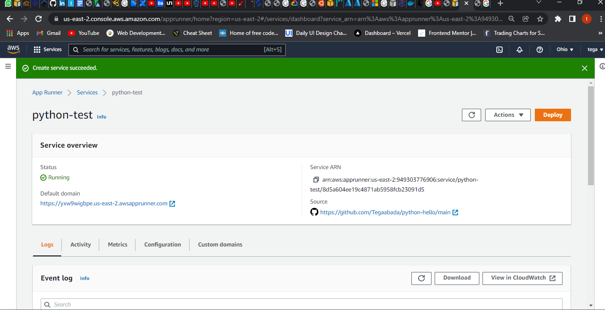
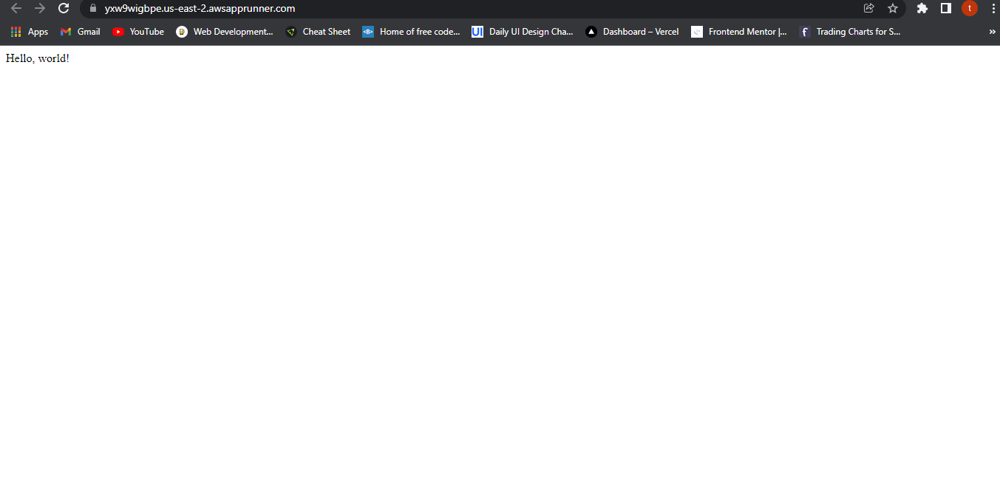
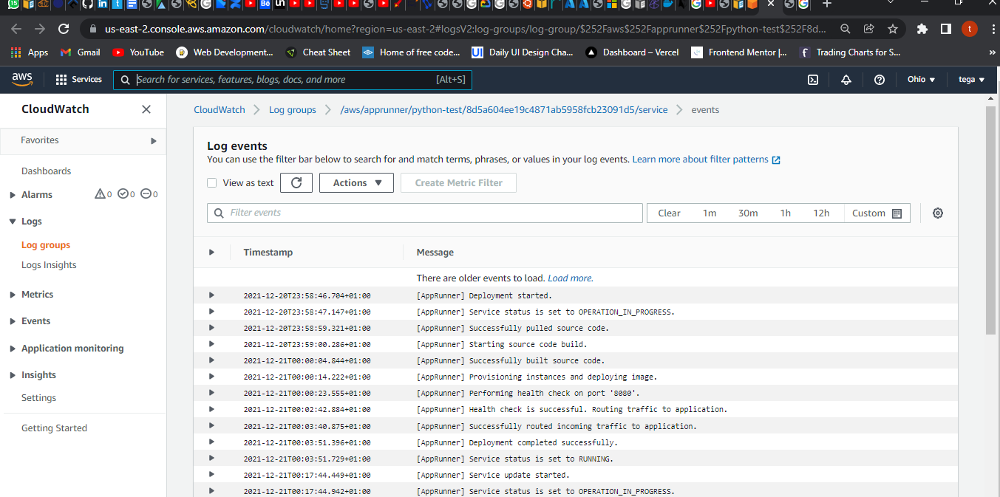

# Lab 4: Deploy a containerized web application with AWS App Runner

1. Create an App Runner service
2. Change your service code
3. Make a configuration change
4. View logs for your service
5. Clean up

### Notes:

Deploy a containerized web application with AWS App Runner
* https://docs.aws.amazon.com/apprunner/latest/dg/getting-started.html

### Getting started with App Runner
For this lab, set up app runner. Then create a github repository named `python-hello`.
Create files in the root directory of the repository, with the names and content specified in the following examples:

`requirements.txt`
```
pyramid==2.0
```

`server.py`
```
from wsgiref.simple_server import make_server
from pyramid.config import Configurator
from pyramid.response import Response
import os

def hello_world(request):
    name = os.environ.get('NAME')
    if name == None or len(name) == 0:
        name = "world"
    message = "Hello, " + name + "!\n"
    return Response(message)

if __name__ == '__main__':
    port = int(os.environ.get("PORT"))
    with Configurator() as config:
        config.add_route('hello', '/')
        config.add_view(hello_world, route_name='hello')
        app = config.make_wsgi_app()
    server = make_server('0.0.0.0', port, app)
    server.serve_forever()
```

#### 1. Create an App Runner service

* Configure source code.
Open the App Runner console, and in the Regions list, select your AWS Region.
* Connect to github and configure deployments.
* Configure, review, and create service.



* Verify service is running by clicking the default URL.

Webpage display:


#### 2. Change your service code
Navigate to the github repository and edit the `service.py` file.
* Verify that the deployment is successful: refresh the browser tab where the webpage of your service is displayed.

#### 3. Make a configuration change

Webpage display:


#### 4. View logs for your service

* Use the App Runner console to view logs for your App Runner service.
* Choose **View in CloudWatch** to open the CloudWatch console and use its full capabilities to explore your App Runner service logs. For a deployment log stream, select a log stream first.

CloudWatch logs:


#### 5. Cleanup

Delete the service by selecting **Action** on the dashboard.
